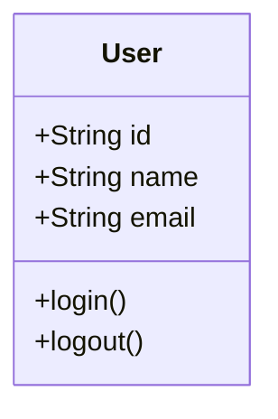

# Obsidian AI Engine Backend

옵시디언 플러그인용 AI 엔진 백엔드 서버입니다.

## 기능

- **다양한 AI 제공자 지원**: Perplexity, OpenAI, Anthropic
- **다양한 출력 형식**: Mermaid 다이어그램, 소스코드, 텍스트
- **백그라운드 실행**: FastAPI 기반 비동기 서버
- **프롬프트 템플릿**: 다양한 용도에 맞는 프롬프트 템플릿 제공

## 설치 및 실행

### 1. 의존성 설치

```bash
cd backend
pip install -r requirements.txt
```

### 2. 서버 실행

```bash
python main.py
```

또는

```bash
python -m src.api_server
```

## 테스트 도구

### 터미널 채팅 테스트

백엔드 서버 없이 터미널에서 직접 AI와 대화할 수 있는 테스트 도구를 제공합니다:

```bash
python test_chat.py
```

**특징:**
- `data.json`에서 API 키 자동 로드
- 실시간 채팅 인터페이스
- 다양한 출력 형식 지원 (text, mermaid, source_code)
- 명령어 지원

**사용 가능한 명령어:**
- `/help` - 도움말 표시
- `/format` - 출력 형식 변경
- `/status` - 현재 설정 확인
- `/clear` - 화면 지우기
- `/quit` - 종료

**사용 예시:**
```
👤 You: 사용자 관리 시스템의 클래스 다이어그램을 만들어주세요
🤖 AI가 응답을 생성하고 있습니다...

🤖 AI (mermaid):
----------------------------------------

----------------------------------------
```

## API 엔드포인트

### 기본 정보
- **서버 주소**: http://localhost:8000
- **API 문서**: http://localhost:8000/docs
- **헬스 체크**: http://localhost:8000/health

### 주요 엔드포인트

#### POST /generate
AI 응답 생성

**요청 예시:**
```json
{
  "prompt": "사용자 계정 관리 시스템의 클래스 다이어그램을 만들어주세요",
  "output_format": "mermaid",
  "provider": "perplexity",
  "source_code": "class User { ... }",
  "diagram_context": "사용자 관리 시스템"
}
```

**응답 예시:**
```json
{
  "success": true,
  "content": "```mermaid\nclassDiagram\n    class User {\n        +String id\n        +String name\n        +String email\n    }\n```",
  "format": "mermaid",
  "provider": "perplexity"
}
```

#### GET /formats
지원하는 출력 형식 및 AI 제공자 목록

#### GET /health
서버 상태 및 API 키 유효성 확인

## 출력 형식

### Mermaid 다이어그램
- `output_format: "mermaid"`
- Mermaid 문법으로 다이어그램 생성
- 플로우차트, 시퀀스 다이어그램, 클래스 다이어그램 등 지원

### 소스코드
- `output_format: "source_code"`
- 다양한 프로그래밍 언어로 소스코드 생성
- Python, JavaScript, TypeScript, Java 등 지원

### 텍스트
- `output_format: "text"`
- 일반적인 텍스트 응답
- 설명, 가이드, 질문 답변 등

## AI 제공자

### Perplexity (기본값)
- 실시간 정보 검색 가능
- 최신 정보 반영

### OpenAI
- GPT-4 모델 사용
- 높은 품질의 응답

### Anthropic
- Claude 모델 사용
- 긴 컨텍스트 처리

## 로그

로그 파일은 `logs/ai_engine.log`에 저장됩니다.

## 개발

### 프로젝트 구조
```
backend/
├── src/
│   ├── __init__.py
│   ├── config.py          # 설정 관리
│   ├── ai_engine.py       # AI 엔진 핵심 로직
│   ├── api_server.py      # FastAPI 서버
│   └── prompt_templates.py # 프롬프트 템플릿
├── logs/                  # 로그 파일
├── main.py               # 메인 실행 파일
├── start.sh              # 시작 스크립트
├── requirements.txt      # Python 의존성
├── env.example           # 환경 변수 예시
└── README.md            # 이 파일
```

### 설정 옵션

`src/config.py`에서 다음 설정을 변경할 수 있습니다:

- 서버 호스트/포트
- 로그 레벨
- API 키
- 타임아웃 설정

## 문제 해결

### API 키 오류
- `.env` 파일에 올바른 API 키가 설정되어 있는지 확인
- `/health` 엔드포인트로 API 키 유효성 확인

### 연결 오류
- 서버가 실행 중인지 확인
- 포트가 사용 중이지 않은지 확인
- 방화벽 설정 확인

### 응답 품질 문제
- 프롬프트를 더 구체적으로 작성
- 적절한 컨텍스트 정보 제공
- 다른 AI 제공자 시도
